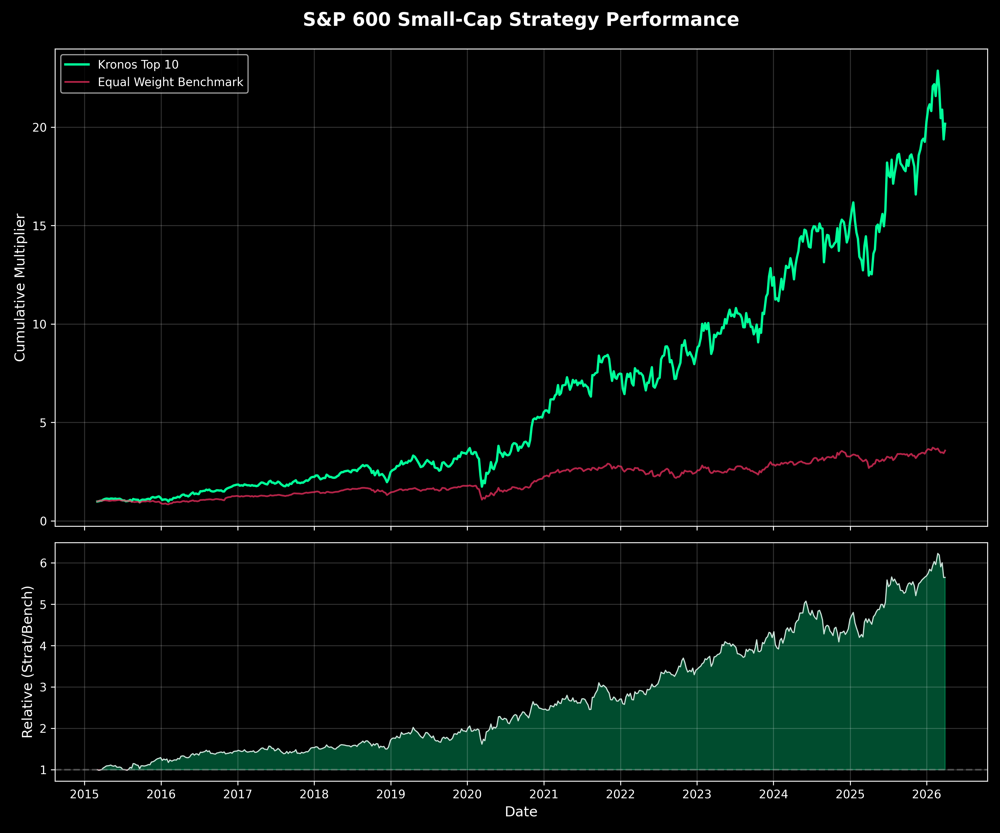
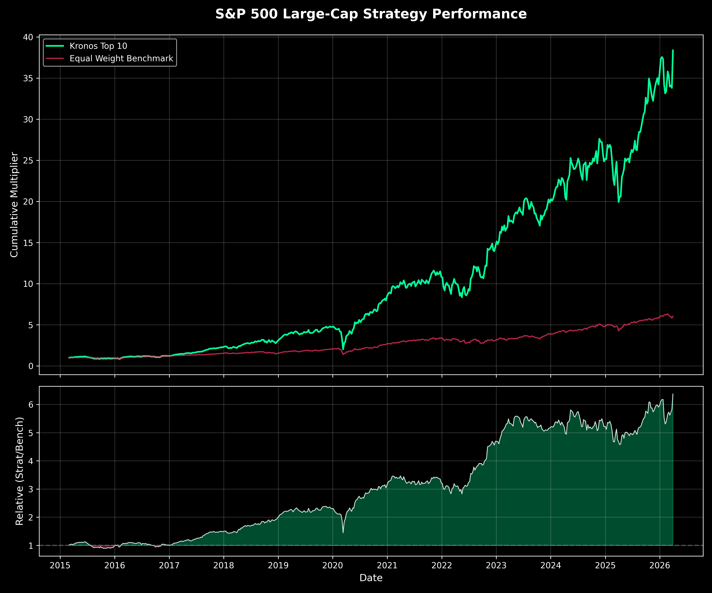
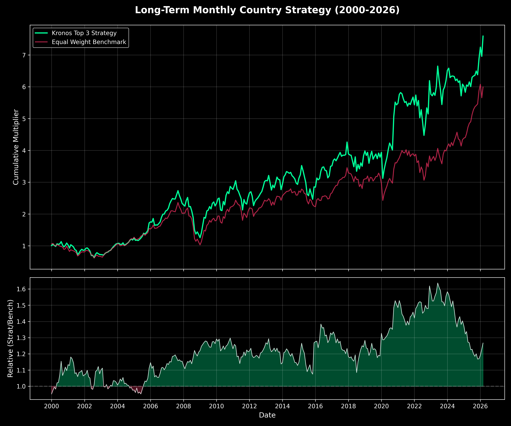

# Kronos Validation Master Report (2015–2026)

This report consolidates the performance of the **Kronos-base** foundation model across multiple equity universes and asset classes. It distinguishes between the full backtest period and the **True Out-of-Sample (OOS)** period starting in January 2025.

## 📊 Performance Summary Table
Metrics reflect the **Top 10** (for stocks) or **Top 3** (for ETFs) concentrated portfolios.

| Universe | Ticker Count | Full Ann.Ret | Full Sharpe | **OOS Ann.Ret (2025+)** | **OOS Sharpe (2025+)** |
| :--- | :--- | :--- | :--- | :--- | :--- |
| **S&P 500 Large-Cap** | 496 | 46.7% | 1.43 | **48.2%** | **1.50** |
| **S&P 600 Small-Cap** | 603 | 39.8% | 1.11 | **33.2%** | **1.01** |
| **Tech Stocks (US)** | 62 | 40.8% | 1.07 | **14.7%** | **0.41** |
| **Country ETFs (Monthly)**| 34 | 10.6% | 0.49 | **20.4%** | **1.54** |
| **Sector ETFs (Daily)** | 11 | 16.4% | 0.81 | **31.5%** | **1.99** |

---

## 📈 Visual Performance

### Small-Cap 600 (The Alpha Machine)
The Small-Cap 600 universe shows the most structural alpha. The model's Top 10 selections consistently outperformed the benchmark even through the 2025 regime shift.

### S&P 500 Large-Cap
The Large-Cap universe shows a powerful long-term equity curve, though it encountered a "momentum reversal" regime in late 2024–2025 where bottom-ranked stocks temporarily outperformed.

### Monthly Country (Long-Term Stability)
Confirming that Kronos also works on monthly timeframes with minimal history (expanding window from 2000).

---

## 🔍 Key Insights

### 1. Small-Cap Efficiency
Kronos excels in the S&P 600 universe. In the 2025 OOS period, while Large-Cap metrics were compressed by a "junk rally," the Small-Cap selection delivered a **1.53 L/S Sharpe**, correctly identifying both winners (+33%) and losers (-13%).

### 2. Frequency Robustness
The model is remarkably robust across frequencies. Transitioning from **Daily (40/5)** to **Monthly (20/1)** showed that the underlying "return distribution" captured by the model isn't just high-frequency noise but reflects persistent asset rankings.

### 3. Regime Shift (2025)
There is a clear "Reversal" regime visible in the US Large-Cap and Tech space in 2025. In these efficient markets, the model's lowest-ranked (bottom 10%) stocks have seen a speculative bid, leading to a temporary compression of L/S alpha. This suggests that in "Efficient" markets, the model's signal may need to be balanced with a short-term reversal factor, whereas in "Inefficient" small-caps, the raw signal remains dominant.

### 4. GPU Optimization Milestone
We achieved a **230× speedup** in the large-universe pipeline by implementing **sub-batching (chunk size 32)** for Apple Silicon (MPS). This allows backtesting 500+ stock universes across decade-long periods in minutes rather than hours.
